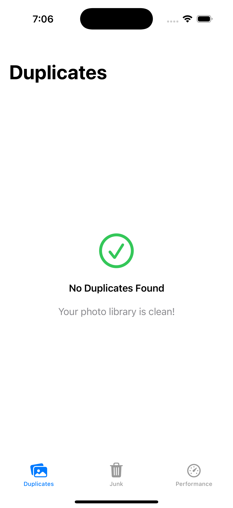
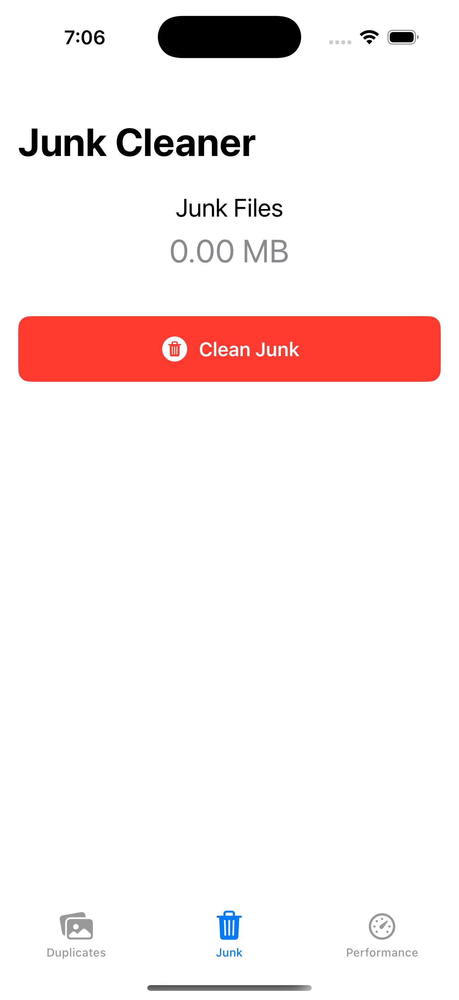
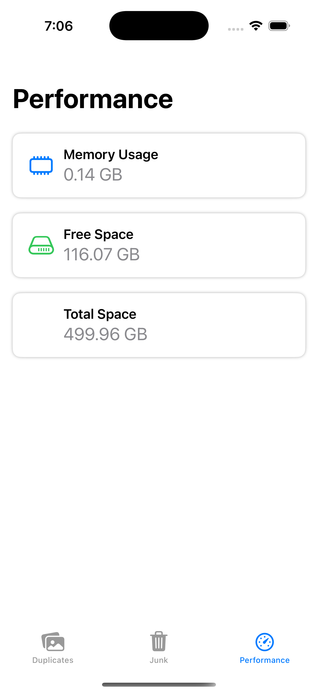

# PhotoClutterCleaner

PhotoClutterCleaner is a SwiftUI app for iOS that helps you find and remove duplicate photos, clean up junk files, and monitor device performance.

## Features
- **Find Duplicate Photos:** Automatically scan your photo library for duplicate images and delete them in one tap.
- **Junk Cleaner:** Remove temporary and junk files to free up space.
- **Performance Monitor:** View real-time memory and disk usage.
- **Modern SwiftUI Interface:** Clean, simple, and responsive design.

## Screenshots

| Duplicates Tab | Junk Cleaner | Performance |
|:-------------:|:-----------:|:-----------:|
|  |  |  |

> Place your screenshots in a `screenshots` folder at the root of the project with the filenames above.

## Getting Started

1. **Clone the repository**
   ```sh
   git clone <your-repo-url>
   cd PhotoClutterCleaner
   ```
2. **Open in Xcode**
   - Double-click `PhotoClutterCleaner.xcodeproj`.
3. **Build & Run**
   - Select your simulator or device and press `Run` (▶️).

## Requirements
- Xcode 15+
- iOS 16.0+

## Permissions
- The app requires access to your photo library to find and remove duplicates. Please grant permission when prompted.

## License
MIT 